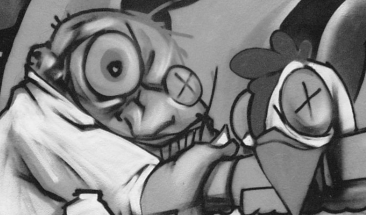
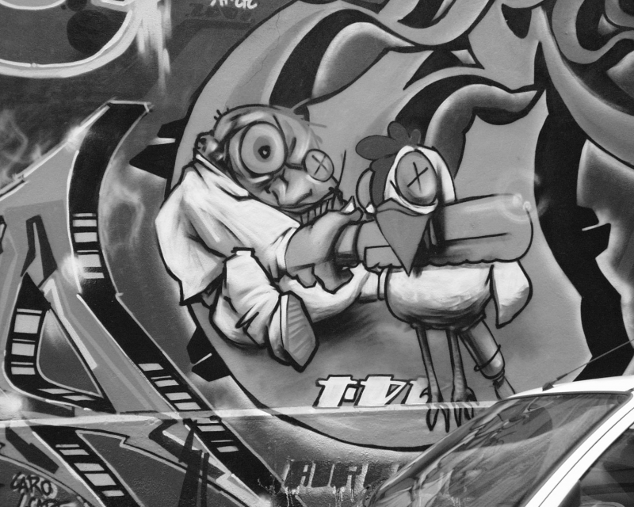
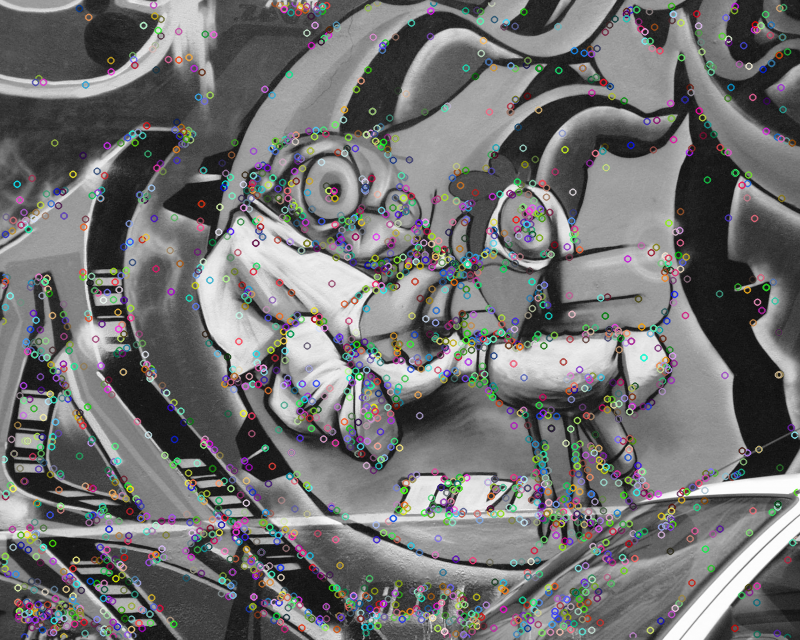
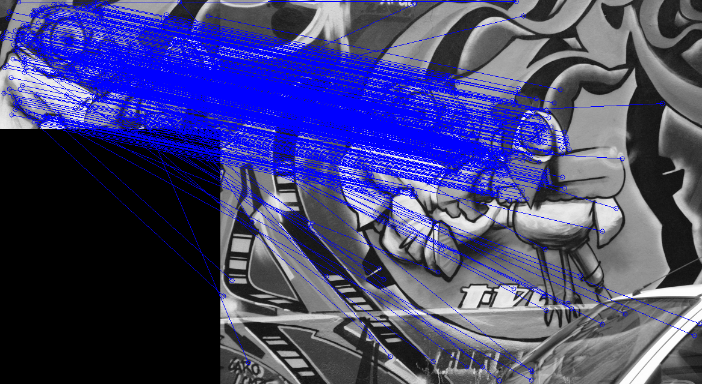
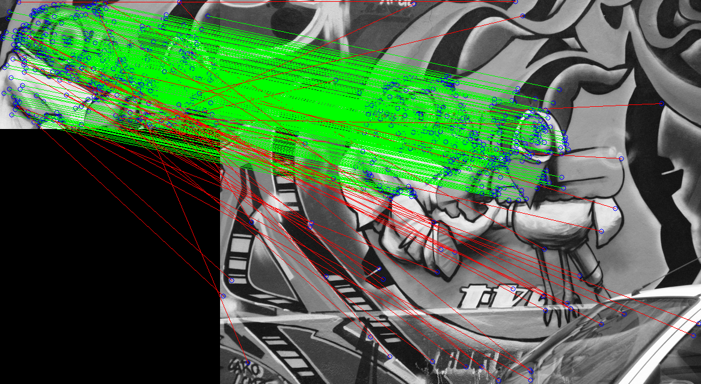

# HomographyEstimation
#### Jordan Hughes
#### UC Santa Barbara
#### hughesj919 at gmail.com

This is a Python 2 based robust homography estimation that uses RANSAC -- a statistical approach for curbing outliers. 
In computer vision, a homography is a matrix that maps coordinates from one plane to the same plane that has been rotated or translated or
transformed in any other way in space. There are many applications of homographies, ranging from motion estimation to creation of
panoramic images.

My script uses OpenCV to first calculate the SIFT keypoints. Those keypoints in each images are then matched using a Nearest Neighbor,
or Brute Force matcher. Four of the correspondences are passed into a function that then calculates a homography. RANSAC will
choose four random correspondences, calculate a homography, count the number of inliers, and keep the homography if it is better
than any homography yet found. There is also a threshold parameter which for the script which takes a floating point number that sets a minimum percentage of 
image points that must be accounted for by the current best homography estimation before RANSAC can stop. 
The threshold is defaulted at 60% of correspondence points accounted for.  If the threshold isn’t met, the function will loop 1000 times.

Usage example is as follows:

```python homography.py --threshold 0.60 img4.pgm img1.pmg```

Script will run and output the number of inliers, max inliers found via RANSAC. When done looping, the final estimated homography will be output as well. File output will be:

* homography.txt - final estimation of homography parameters
* Matches.png - shows all points and matches between the two images.
* InlierMatches.png. - draws all matches and colors them based on whether they are inliers in the final homography or not.
* sift_keypoints.png - all the keypoints found by the SIFT 

##### These are the original images: 




##### Finding our keypoints using SIFT:



##### Bruteforce Matching:



##### Final inliers using our homography matrix:



